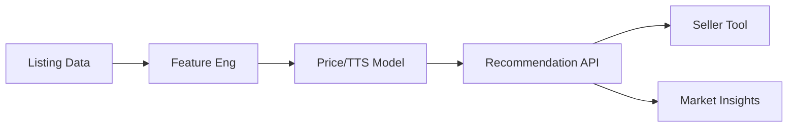

# Operationalization – Exploring_eBay_Car_Sales_Data

## System flow

## Target user, value proposition, deployment

**Target user:** Sellers and dealers. **Value proposition:** Used car listing insights – price and time-to-sale predictions, optional API for sellers, market trend views. **Deployment:** Recommendation API or dashboard.

## Next steps

1. **run.py:** Load autos.csv; compute baseline (median price by make); optional simple model and RMSE/MAE.
2. **API:** Endpoint for price prediction given attributes.
3. **Market insights:** Trend charts by segment.
