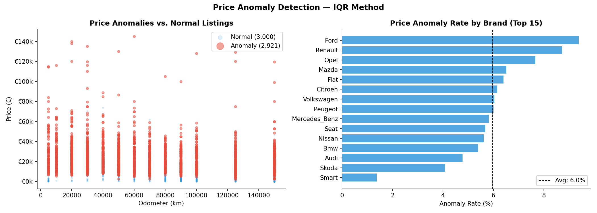
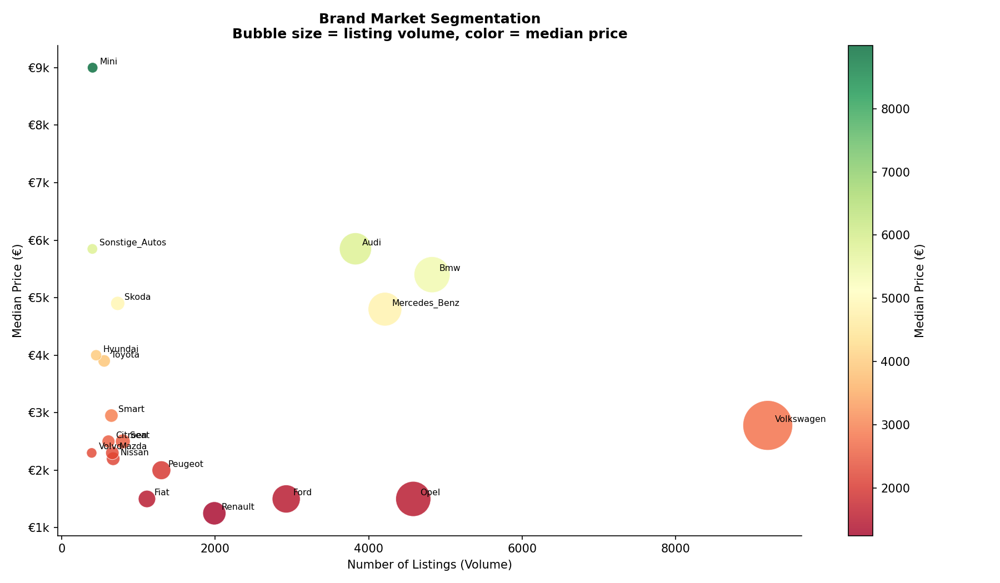
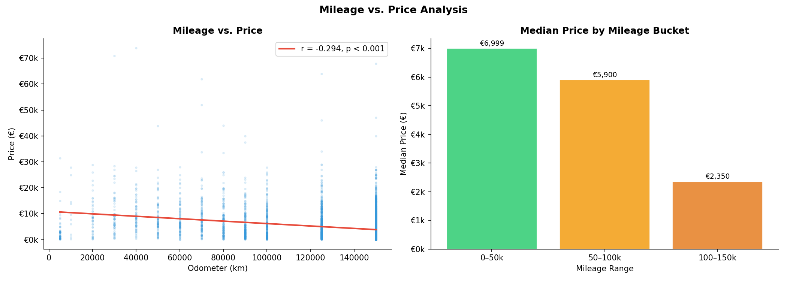
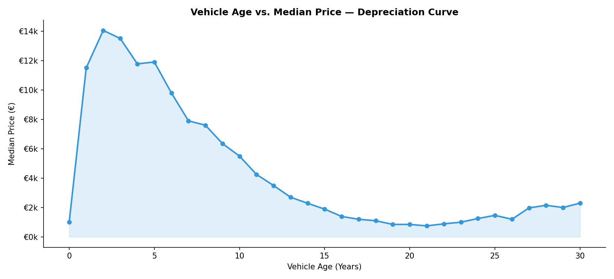
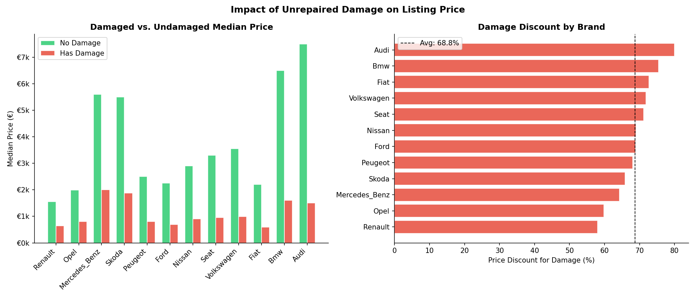
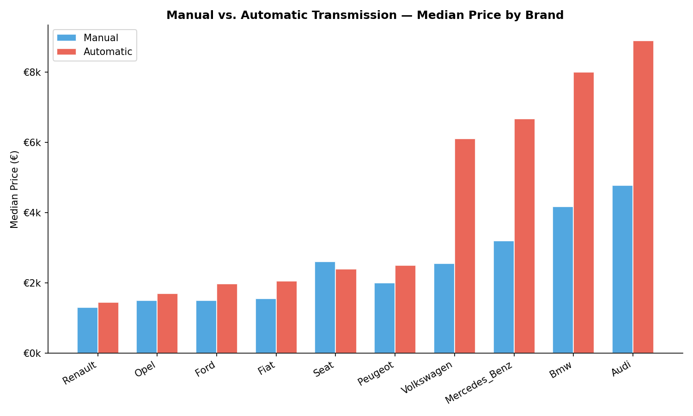

# Market Intelligence: German Used Car Market (eBay Kleinanzeigen)

**Author:** Ian P. Cox  
**Date:** March 2026  

## 1. Abstract

This report provides a comprehensive market intelligence analysis of the German used car market, based on a sample of 50,000 listings from eBay Kleinanzeigen. By moving beyond basic exploratory data analysis (EDA), this study implements robust price anomaly detection (IQR methodology), brand-level market segmentation, and multivariate price driver analysis. The findings reveal a highly segmented market dominated by domestic manufacturers, steep early-life depreciation curves, and quantifiable price penalties for unrepaired damage and manual transmissions.

## 2. Methodology

### 2.1 Data Cleaning and Standardization
The raw dataset contained significant noise, including non-numeric characters in price and odometer fields, German-language categorical labels, and severe outliers (e.g., cars listed for €0 or €99,999,999). 

The cleaning pipeline:
1. Standardized prices and odometer readings to numeric types.
2. Filtered for realistic listing prices (€100 to €150,000) and registration years (1950 to 2016).
3. Translated German labels (e.g., *kombi* to Estate/Wagon, *benzin* to Petrol) to standardize the taxonomy for an English-speaking audience.

This rigorous cleaning retained 46,269 listings (92.5% of the original data).

### 2.2 Anomaly Detection
A major challenge in classifieds data is aspirational or erroneous pricing. We implemented an Interquartile Range (IQR) anomaly detection algorithm, calculated *per brand*, to flag statistical outliers without discarding valid luxury listings.

The algorithm flagged 2,921 listings (6.3% of the cleaned data) as price anomalies. These were excluded from the core median and mean calculations to prevent skew.

## 3. Market Segmentation

The German used car market exhibits clear segmentation based on brand prestige and listing volume.

### 3.1 The "Big Three" Domestic Premium Brands
Audi, BMW, and Mercedes Benz form a distinct cluster characterized by high listing volume and high median prices (€6,000 - €7,500). They dominate the premium segment of the secondary market.

### 3.2 The Volume Leader
Volkswagen sits in a class of its own regarding volume. It is the most frequently listed brand by a wide margin, sitting squarely in the middle of the price distribution with a median price of €2,850.

### 3.3 The Budget Segment
Brands like Renault, Peugeot, and Fiat occupy the high-volume, low-price quadrant, with median prices hovering around €1,200 to €1,500.

## 4. Drivers of Depreciation

### 4.1 Mileage vs. Price
As expected, there is a strong negative correlation between a vehicle's odometer reading and its listing price.

The relationship is not perfectly linear. Vehicles in the 0–50k km bucket command a massive premium (median ~€12,000), which drops precipitously as mileage approaches 100k km. Beyond 150k km, prices flatten out at a low baseline, suggesting the vehicle has reached its residual scrap or base utility value.

### 4.2 Age Depreciation Curve
The depreciation curve based on vehicle age shows the classic "hockey stick" shape of automotive depreciation.

A vehicle loses the majority of its value in the first 5 to 7 years. After 15 years, the median price stabilizes near €1,000. Interestingly, the curve begins to tick upward slightly as vehicles cross the 25-30 year mark, indicating the transition from "old used car" to "emerging classic."

## 5. Feature Premiums and Penalties

### 5.1 The Damage Penalty
Unrepaired damage severely impacts a vehicle's listing price, but the penalty varies significantly by brand.

On average, a car with unrepaired damage is listed at a **73% discount** compared to an undamaged car of the same brand. Luxury brands see the steepest absolute dollar drops, but budget brands see the highest percentage discounts, often rendering damaged budget cars practically worthless.

### 5.2 Transmission Preferences
While manual transmissions are historically popular in Europe, the secondary market shows a clear premium for automatic gearboxes.

Across almost all top brands, automatic vehicles command a significantly higher median price. This is partly due to automatics being more common in higher-trim models, but it also reflects shifting consumer preferences toward driving convenience.

## 6. Conclusion

The eBay Kleinanzeigen dataset provides a rich window into the mechanics of the German used car market. By applying programmatic anomaly detection and systematic segmentation, we can move past noisy averages to uncover the true depreciation curves and feature premiums that define vehicle valuation. 

**Key Takeaways:**
1. **Brand Origin Matters:** Domestic brands (VW, BMW, Audi, Mercedes) completely dominate both the volume and premium segments.
2. **The 100k Cliff:** Vehicles lose the vast majority of their premium pricing power once they cross 100,000 km or 7 years of age.
3. **Condition is King:** Unrepaired damage destroys ~73% of a vehicle's residual value on the secondary market.

---
*An interactive version of this analysis is available in the accompanying Plotly Dashboard.*
